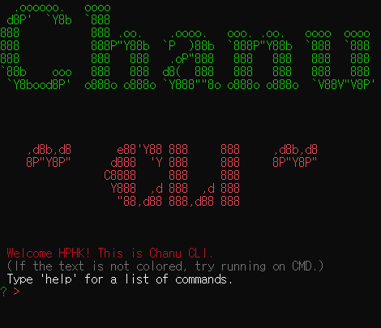

# Chanu-CLI✨
    

total package downloads : 1,198

## Command Line Interface💻 Resume📜 
- Node.js와 NPM을 이용한 CLI형식 resume.
- npm package: https://www.npmjs.com/package/chanucli

## Quick start🦅
- (CMD recommended)

### Installation
- 아래 세가지 방법 중 한 가지로 설치한다.
- 양찬우는 글로벌 인재이기 때문에 간단한 전역 설치를 추천한다. 

#### 1. 전역 설치 
- `npm install -g chanucli`
- `chanucli` 

#### 2. 로컬 설치 - 1
- 현 저장소 `git clone`
- `npm install`
- `npm start`

#### 3. 로컬 설치 - 2 
- `npm init -y`
- `npm install chanucli`
- `npx chanucli`

## Documentation
- 실행
    - 로컬 설치-1: `npm start` 
    - 로컬 설치-2: `npx chanucli`
    - 전역 설치시: `chanucli`

- commands list:
    - `help`: 명령어 모음 
    - `info`: 간단한 신상명세 
    - `choice`: 선택지 및 추가기능 제공 
    - `notion`: Notion Resume 페이지 링크
    - `hello`: 개발자의 인사 
    - `bye`: chanu-cli 종료
    - `????`: 비-밀

# 개발 기록🛠
## 목표
- `npm`과 node.js를 이용한 CLI를 통해 색다른 Developer Resume 제작
- `npm`에 대한 이해와 package publish 경험 쌓기

## 구현 내용
- 설치 시 ASCII art를 이용한 환영 메세지
- 지정된 명령어 입력시 정보 제공
- 선택지 제공 
  - 배포된 포트폴리오 페이지 연결
  - notion resume 연결 
  - 간단한 신상명세 제공

## 회고
- 생각보다 `npm`을 시작하는 건 어렵지 않았고, 예상대로 제대로 공부하는 건 어려웠다. 
- `npm`을 통해 직접 만든 패키지를 배포한다는 것이 매우 신선하고 재밌었다.
- 처음 아이디어 단계에선 지식의 부재와 `npm`이 매우 어려울 것이라는 선입견으로 너무 단기간에 큰 목표를 세우는 것이 아닌가 두려웠지만, 역시 뭐든 해봐야 제대로 아는 법이었다.  
- `npm`의 여러 명령어를 더 깊게 이해했고 `package.json`에 대한 이해가 생겼다.
- 로컬과 전역의 차이에 대한 이해도가 깊어졌다.  
- 버전관리의 숙명을 느꼈다.
